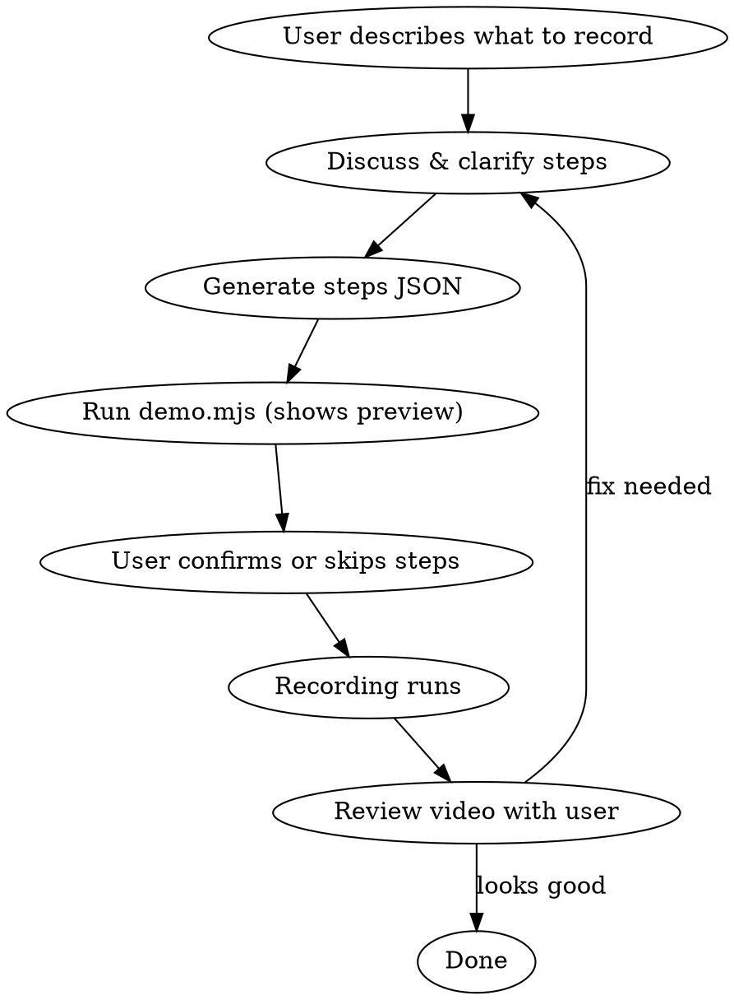

# Record Demo

Automated browser demo recorder. Discusses steps with user, generates a steps JSON, previews for confirmation, then records an MP4 via Playwright.

## Setup (First Time)

Find the plugin install directory and install dependencies:

```bash
PLUGIN_DIR=$(find ~/.claude/plugins/cache -type f -name "demo.mjs" -path "*/record-demo*" -exec dirname {} \; | head -1)
cd "$PLUGIN_DIR" && npm install
```

The plugin directory contains:
- `demo.mjs` — the recording engine
- `inspect-page.mjs` — page inspection utility

Recordings and steps files are saved to the **current working directory** by default.

## Workflow



### Step 1: Understand what to record

Ask the user:
- What URL/page to record (local file, localhost, or external)
- What interactions to show (click tabs, open modals, scroll, etc.)
- How fast it should move (default: brisk)
- Output filename

### Step 2: Generate steps JSON

Write a `<name>-steps.json` file in the current working directory. Each step is an object with an `action` field.

### Step 3: Run the recording

**Always use a Sonnet subagent** to run the recording — it handles the task well and costs ~80x less than Opus. Spawn the recording via the Agent tool with `model: "sonnet"`:

```
Agent({
  model: "sonnet",
  prompt: "Find the record-demo plugin directory and run the recording:\n\nPLUGIN_DIR=$(find ~/.claude/plugins/cache -type f -name 'demo.mjs' -path '*record-demo*' -exec dirname {} \\; | head -1)\nnode \"$PLUGIN_DIR/demo.mjs\" --steps <name>-steps.json --output <name>.mp4 --no-setup\n\nDo NOT modify any files. Just run the command and report success/failure.",
  description: "Record demo"
})
```

The agent shows a step preview and prompts for confirmation before recording. Add `--no-confirm` to skip the preview.

First-time setup (login, preferences) — run without `--no-setup` so the user can configure the browser profile manually.

## Recording Local Files

**Standalone HTML prototypes:** Navigate directly to the file path.
```json
{ "action": "navigate", "url": "file:///Users/you/project/index.html" }
```

**Dev servers:** Make sure the server is running first, then use the localhost URL.
```json
{ "action": "navigate", "url": "http://localhost:3000/page" }
```

## Viewport & Resolution

The engine supports `--width` and `--height` flags (defaults: 1920x1200).

For standard demos, use 1440x900:
```bash
node "$PLUGIN_DIR/demo.mjs" --steps my-steps.json --output demo.mp4 --no-setup --width 1440 --height 900
```

## Available Actions

| Action | Key Fields | What it does |
|--------|-----------|--------------|
| `navigate` | `url` (or `"back"`) | Go to URL or back |
| `click` | `selector` | Click element via Playwright selector |
| `click-js` | `text` | Find text in DOM, walk up to clickable ancestor, click |
| `click-link` | `selector` | Click link, handle new tab open/close |
| `scroll` | `amount`, `duration` | Smooth scroll down by pixels |
| `scroll-top` | — | Smooth scroll to top |
| `type` | `selector`, `text` | Click element and type text |
| `press` | `key` | Press keyboard key (e.g. `Escape`) |
| `hover` | `selector` | Hover over element |
| `wait` | `seconds` | Pause |

All actions support `note` (label shown in logs/preview) and `pauseAfter` (ms delay after action).

## Selector Tips

- **IDs and data attributes first:** `#start-btn`, `[data-panel='spring-collection']`, `[data-testid='save-button']`
- **Role-based selectors for React:** `role=button[name="Save"]`, `role=link[name="Manage Packages"]`
- **Text selectors for visible labels:** `text=Submit`, `text=Cancel`
- **Class selectors as fallback:** `.bg-red-500`, `.flex.items-center`
- Prefer `click` with CSS selectors over `click-js` when IDs or data attributes are available
- Use `click-js` when the text is visible but there's no stable selector

## Pacing Guidelines

For a brisk demo:
- `pauseAfter`: 500-800ms for scrolls, 1000-1500ms for tab clicks, 2000-3000ms for important views
- `scroll duration`: 1000-1200ms
- `wait`: 1-2s max

## Error Handling

The agent logs warnings with timestamps when selectors aren't found:
```
⏳ 3s — still looking for: "selector" (step note)
```
After 10s timeout, saves a debug screenshot to `debug-<timestamp>.png`. Review the screenshot to fix selectors.

## Common Mistakes

- Using `text=Submit` when "Submit" appears multiple times — add more context: `button:has-text('Submit')` or use a data attribute
- Forgetting `pauseAfter` on fast actions — the recording will look rushed without pauses
- Not running the dev server before recording a localhost URL
- Using `click-js` when a stable CSS selector exists — `click` is more reliable

## Example Steps JSON

```json
[
  { "action": "navigate", "url": "http://localhost:3000", "note": "Open app" },
  { "action": "wait", "seconds": 1 },
  { "action": "click", "selector": "#login-btn", "note": "Click Login", "pauseAfter": 1000 },
  { "action": "type", "selector": "#email", "text": "demo@example.com", "pauseAfter": 500 },
  { "action": "click", "selector": "button[type='submit']", "note": "Submit form", "pauseAfter": 2000 },
  { "action": "scroll", "amount": 300, "duration": 1000, "note": "Scroll down", "pauseAfter": 800 },
  { "action": "wait", "seconds": 2, "note": "Show final state" }
]
```
